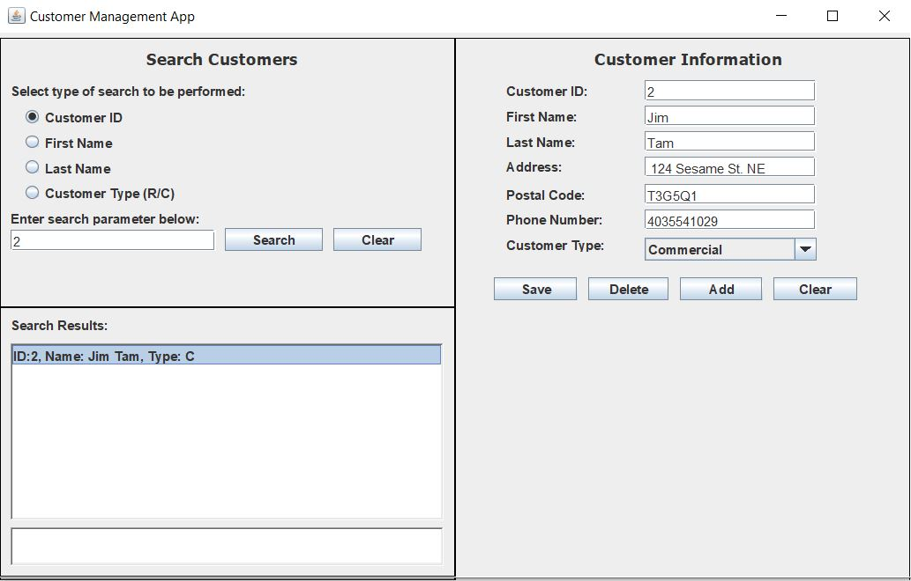

# Tool Shop Manager
A tool shop manager application that manages customers and inventory, developed using MVC architecture. 

## Some highlights of the application:

- Multi-threaded client-server application
- MVC architecture
- Reads and writes to a MySQL database using JDBC and prepared statements
- Serialization using GSON

## Screenshots:

Login Screen:

Inventory Manager:

Customer Manager:

Database Relational Model:

## Running the application:

1) need to add the gson-2.8.6.jar as an referenced library to BOTH and mysql-connector-java-5.1.49-bin.jar as a referenced library to ToolShopServer 
	(jar files in src folders for both packages).

2) Database can be replicated using the ToolShopDB.sql file included

3) To run the app, run one instance of the ServerController.java in ToolShopServer -> controller

4) Run instances of the ClientController.java in ToolShopClient -> controller
